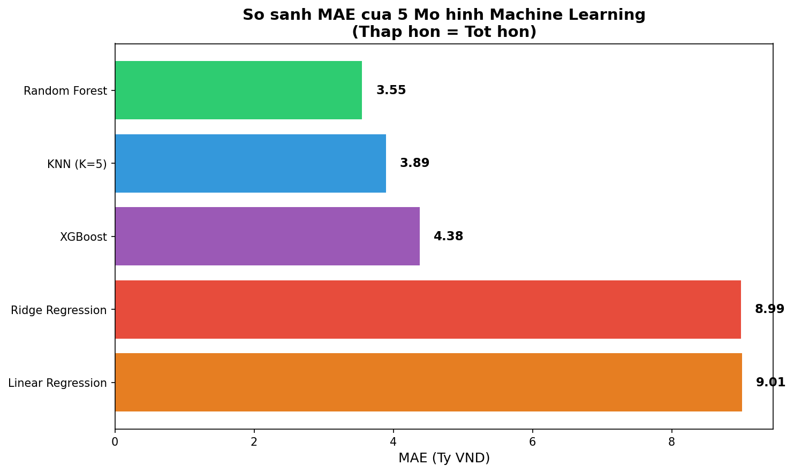
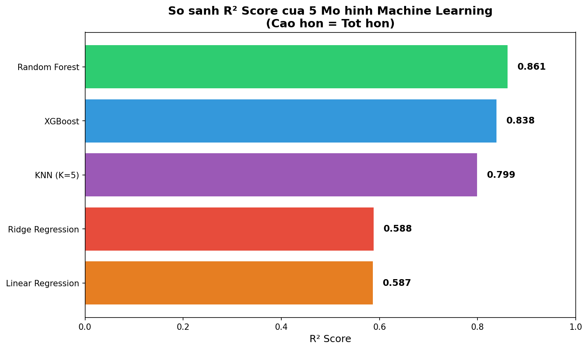

# Dự đoán Giá Bất động sản Hà Nội 2024 🏠📈

Dự án cuối kỳ cho môn **Nhập môn Học máy (IT3190)**. Hệ thống sử dụng các thuật toán Học máy (Machine Learning) để dự báo giá nhà tại khu vực Hà Nội dựa trên các thông số diện tích, vị trí và đặc điểm hạ tầng.

## 🌟 Tính năng nổi bật
- **Tiền xử lý dữ liệu thông minh**: Tự động bóc tách đơn vị (tỷ, triệu, m2), số hóa thông tin và điền khuyết (Imputation) theo vị trí địa lý.
- **Phân tích EDA chuyên sâu**: Trực quan hóa tương quan dải giá theo Quận/Huyện và phân phối giá thị trường năm 2024.
- **Đa mô hình so sánh**: Thử nghiệm trên **5 thuật toán ML**: Linear Regression, Ridge Regression, KNN, Random Forest và XGBoost.
- **Công cụ dự báo (Inference)**: Cung cấp hàm dự đoán nhanh cho người dùng.

## 🤖 5 Thuật toán Machine Learning

| # | Thuật toán | Loại | Mô tả |
|---|------------|------|-------|
| 1 | **Linear Regression** | Cơ bản | Hồi quy tuyến tính - Baseline model |
| 2 | **Ridge Regression** | Cơ bản | Hồi quy tuyến tính + Regularization L2 |
| 3 | **K-Nearest Neighbors (KNN)** | Cơ bản | Dự đoán dựa trên K điểm dữ liệu gần nhất |
| 4 | **Random Forest** | Ensemble | Kết hợp nhiều cây quyết định |
| 5 | **XGBoost** | Boosting | Gradient Boosting hiệu suất cao |

## 📊 Kết quả thực nghiệm

### Bảng so sánh 5 mô hình:

| Model | MAE (Tỷ VNĐ) | RMSE (Tỷ VNĐ) | R² Score | Xếp hạng |
|-------|--------------|---------------|----------|----------|
| **Random Forest** | **3.55** | 9.57 | **0.861** | 🥇 1 |
| KNN (K=5) | 3.89 | 10.40 | 0.799 | 🥈 2 |
| XGBoost | 4.38 | 10.22 | 0.838 | 🥉 3 |
| Ridge Regression | 8.99 | 52.80 | 0.588 | 4 |
| Linear Regression | 9.01 | 52.87 | 0.587 | 5 |

### 🏆 Mô hình tốt nhất: **Random Forest Regressor**
- **R-squared ($R^2$):** 0.86
- **MAE (Sai số trung bình):** 3.55 tỷ VNĐ (trên dải giá rộng 0.5 - 200 tỷ)

### 📈 Biểu đồ so sánh các mô hình

| So sánh MAE | So sánh R² Score |
| :---: | :---: |
|  |  |

### 📉 Phân tích dự án
| Phân phối Giá | Biểu đồ Tương quan |
| :---: | :---: |
|  |  |

| Giá theo Quận | Độ quan trọng của Biến |
| :---: | :---: |
|  |  |

| Kết quả dự báo (Actual vs Predicted) |
| :---: |
|  |

*Chi tiết các bước thực hiện có thể tìm thấy trong [PROJECT_LOG.md](./PROJECT_LOG.md).*

## 🛠 Cấu trúc thư mục
- `HN_Houseprice.csv`: Dữ liệu thô ban đầu.
- `data_analysis.py`: Script phân tích cấu trúc và thống kê dữ liệu ban đầu.
- `preprocessing.py`: Quy trình làm sạch dữ liệu và xử lý Outliers.
- `eda_analysis.py`: Khai phá dữ liệu và trực quan hóa phân phối.
- `model_training.py`: Huấn luyện và so sánh **5 mô hình ML**.
- `inference.py`: Công cụ dự báo giá cho bất động sản mới.
- `PROJECT_LOG.md`: Nhật ký chi tiết toàn bộ quá trình phát triển dự án.

## 🚀 Hướng dẫn cài đặt và sử dụng (Chi tiết cho người mới)

### 📌 Yêu cầu hệ thống
- **Hệ điều hành:** Windows 10/11, macOS, hoặc Linux
- **Python:** Phiên bản 3.8 trở lên
- **RAM:** Tối thiểu 4GB (khuyến nghị 8GB)
- **Dung lượng ổ cứng:** ~500MB

---

### 🔰 BƯỚC 0: Kiểm tra và cài đặt Python (Nếu chưa có)

#### Kiểm tra Python đã cài chưa:
```bash
python --version
```
Nếu hiện `Python 3.x.x` → Đã có Python, chuyển sang Bước 1.

Nếu báo lỗi → Cần cài Python:

#### Cài đặt Python (Windows):
1. Truy cập: https://www.python.org/downloads/
2. Tải bản Python 3.11 hoặc mới hơn
3. Chạy file cài đặt, **✅ QUAN TRỌNG: Tick vào "Add Python to PATH"**
4. Nhấn "Install Now"
5. Khởi động lại Command Prompt/Terminal

---

### 🔰 BƯỚC 1: Tải dự án về máy

#### Cách 1 - Clone bằng Git (Khuyến nghị):
```bash
git clone https://github.com/[username]/Hoc-May-Khai-Pha-Du-Lieu.git
cd Hoc-May-Khai-Pha-Du-Lieu
```

#### Cách 2 - Tải file ZIP:
1. Nhấn nút "Code" → "Download ZIP" trên GitHub
2. Giải nén file ZIP
3. Mở Terminal/Command Prompt và di chuyển vào thư mục:
```bash
cd đường/dẫn/tới/thư/mục/Hoc-May-Khai-Pha-Du-Lieu
```

---

### 🔰 BƯỚC 2: Tạo môi trường ảo (Virtual Environment) - Khuyến nghị

#### Trên Windows (Command Prompt hoặc PowerShell):
```bash
# Tạo môi trường ảo
python -m venv venv

# Kích hoạt môi trường ảo
venv\Scripts\activate
```

#### Trên macOS/Linux:
```bash
# Tạo môi trường ảo
python3 -m venv venv

# Kích hoạt môi trường ảo
source venv/bin/activate
```

> 💡 **Lưu ý:** Khi môi trường ảo được kích hoạt, bạn sẽ thấy `(venv)` xuất hiện ở đầu dòng lệnh.

---

### 🔰 BƯỚC 3: Cài đặt các thư viện cần thiết

```bash
pip install pandas numpy scikit-learn matplotlib seaborn xgboost joblib streamlit
```

Hoặc nếu có file requirements.txt:
```bash
pip install -r requirements.txt
```

#### Kiểm tra cài đặt thành công:
```bash
pip list
```
Đảm bảo các thư viện sau xuất hiện: pandas, numpy, scikit-learn, matplotlib, seaborn, xgboost, joblib, streamlit

---

### 🔰 BƯỚC 4: Chạy quy trình Machine Learning

#### 📋 **Quy trình chạy ứng dụng**

```
┌─────────────────────────────────────────────────────────────────────────┐
│                        QUY TRÌNH CHẠY ỨNG DỤNG                          │
├─────────────────────────────────────────────────────────────────────────┤
│                                                                         │
│  Bước 1: TIỀN XỬ LÝ DỮ LIỆU                                             │
│  ─────────────────────────────                                          │
│  python preprocessing_nha.py                                            │
│  → Đầu vào: HN_Houseprice.csv                                           │
│  → Đầu ra:  HN_Houseprice_Processed.csv                                 │
│                        │                                                │
│                        ▼                                                │
│  Bước 2: PHÂN TÍCH EDA (Tùy chọn)                                       │
│  ─────────────────────────────────                                      │
│  python eda_analysis_nha.py                                             │
│  → Trực quan hóa dữ liệu, phân tích phân phối giá                       │
│  → Xuất biểu đồ: distribution_analysis.png, correlation_heatmap.png     │
│                        │                                                │
│                        ▼                                                │
│  Bước 3: HUẤN LUYỆN MÔ HÌNH                                             │
│  ──────────────────────────                                             │
│  python model_training_nha.py                                           │
│  → Đầu vào: HN_Houseprice_Processed.csv                                 │
│  → Đầu ra:  gia_nha_model.joblib (model đã train)                       │
│                        │                                                │
│                        ▼                                                │
│  Bước 4: DỰ ĐOÁN GIÁ NHÀ                                                │
│  ───────────────────────                                                │
│  Cách A - Dùng Script:                                                  │
│    python inference_nha.py                                              │
│                                                                         │
│  Cách B - Dùng Web App (Khuyến nghị):                                   │
│    streamlit run app.py                                                 │
│    → Mở trình duyệt: http://localhost:8501                              │
│                                                                         │
└─────────────────────────────────────────────────────────────────────────┘
```

#### 🔧 **Chi tiết các bước**

**Bước 1: Tiền xử lý dữ liệu**
```bash
python preprocessing_nha.py
```
- Làm sạch dữ liệu thô từ `HN_Houseprice.csv`
- Chuyển đổi đơn vị giá (tỷ, triệu) và diện tích (m²)
- Xử lý giá trị thiếu và outliers
- Xuất file `HN_Houseprice_Processed.csv`

**Bước 2: Phân tích EDA (Tùy chọn)**
```bash
python eda_analysis_nha.py
```
- Trực quan hóa phân phối giá theo quận
- Phân tích tương quan giữa các biến
- Xuất các biểu đồ phân tích

**Bước 3: Huấn luyện mô hình**
```bash
python model_training_nha.py
```
- Train model Random Forest Regressor
- Đánh giá hiệu suất (R², MAE, RMSE)
- Lưu model vào file `gia_nha_model.joblib`

**Bước 4: Dự đoán giá nhà**

*Cách A - Dùng Script Python:*
```bash
python inference_nha.py
```

*Cách B - Dùng Web App Streamlit (Khuyến nghị):*
```bash
streamlit run app.py
```
Sau đó mở trình duyệt tại địa chỉ: **http://localhost:8501**

### 3. Ví dụ dự báo mẫu
Trong file `inference_nha.py`, bạn có thể thay đổi các thông số:
```python
predicted = predict_price(
    district='Cầu Giấy',     # Quận/Huyện
    bedrooms=4,               # Số phòng ngủ
    bathrooms=3,              # Số phòng tắm
    area_m2=100.0             # Diện tích (m²)
)
print(f"Giá dự kiến: {predicted:.2f} tỷ VNĐ")
```

### 4. Chạy nhanh (Quick Start)
Nếu đã có file model (`gia_nha_model.joblib`), chỉ cần chạy:
```bash
streamlit run app.py
```

## 📝 Nhật ký Dự án
Dự án được thực hiện với vai trò **Data Engineer** và **Data Scientist**. Mọi quyết định kỹ thuật như xử lý Log Transformation hay xử lý Data Leakage đều được ghi lại minh bạch trong file Nhật ký.

---
*Dự án được phát triển bởi Giang Hoàng Trường.*
