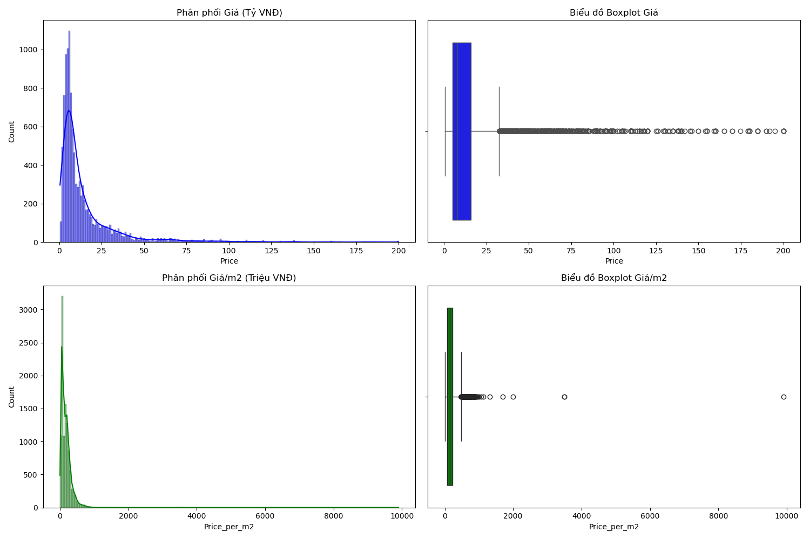
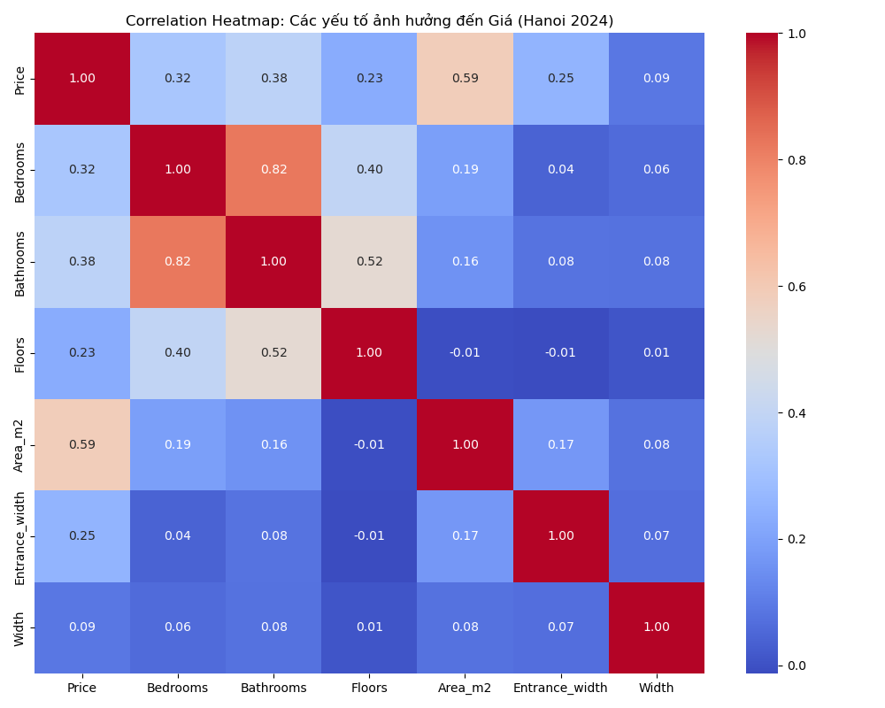
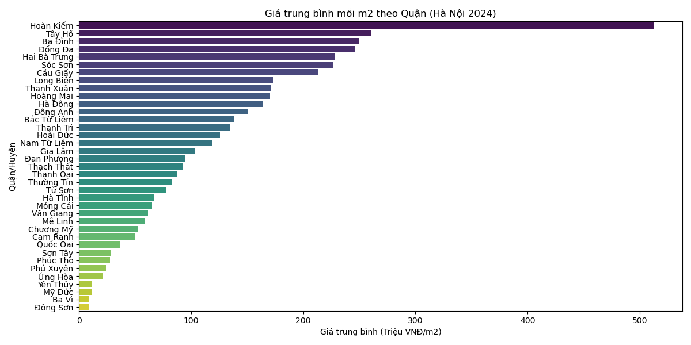
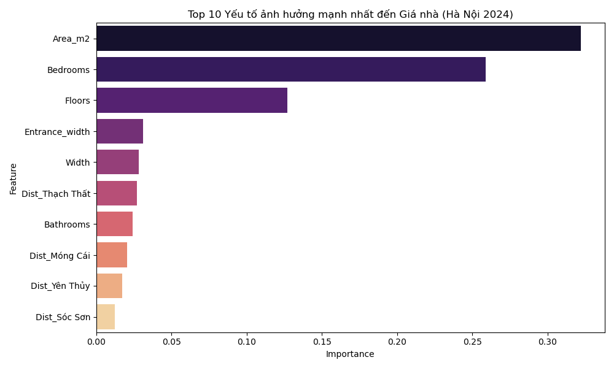
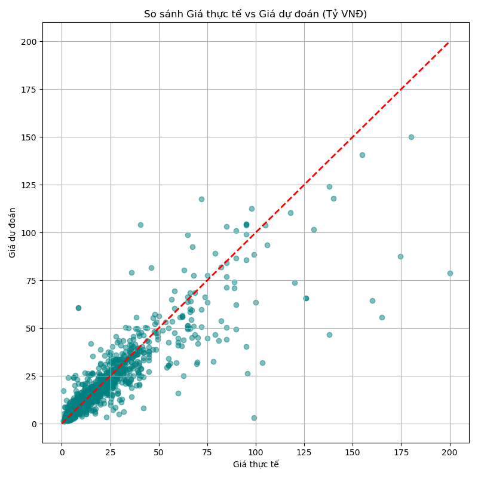

# Dự đoán Giá Bất động sản Hà Nội 2024 🏠📈

Dự án cuối kỳ cho môn **Nhập môn Học máy (IT3190)**. Hệ thống sử dụng các thuật toán Học máy (Machine Learning) để dự báo giá nhà tại khu vực Hà Nội dựa trên các thông số diện tích, vị trí và đặc điểm hạ tầng.

## 🌟 Tính năng nổi bật
- **Tiền xử lý dữ liệu thông minh**: Tự động bóc tách đơn vị (tỷ, triệu, m2), số hóa thông tin và điền khuyết (Imputation) theo vị trí địa lý.
- **Phân tích EDA chuyên sâu**: Trực quan hóa tương quan dải giá theo Quận/Huyện và phân phối giá thị trường năm 2024.
- **Đa mô hình so sánh**: Thử nghiệm trên Linear Regression, Random Forest và XGBoost.
- **Công cụ dự báo (Inference)**: Cung cấp hàm dự đoán nhanh cho người dùng.

## 📊 Kết quả thực nghiệm
Mô hình **Random Forest Regressor** đạt hiệu quả cao nhất:
- **R-squared ($R^2$):** 0.86
- **MAE (Sai số trung bình):** 3.5 tỷ VNĐ (trên dải giá rộng 0.5 - 200 tỷ).

### 📉 Phân tích dự án
| Phân phối Giá | Biểu đồ Tương quan |
| :---: | :---: |
|  |  |

| Giá theo Quận | Độ quan trọng của Biến |
| :---: | :---: |
|  |  |

| Kết quả dự báo (Actual vs Predicted) |
| :---: |
|  |

*Chi tiết các bước thực hiện có thể tìm thấy trong [PROJECT_LOG.md](./PROJECT_LOG.md).*

## 🛠 Cấu trúc thư mục
- `HN_Houseprice.csv`: Dữ liệu thô ban đầu.
- `data_analysis.py`: Script phân tích cấu trúc và thống kê dữ liệu ban đầu.
- `preprocessing.py`: Quy trình làm sạch dữ liệu và xử lý Outliers.
- `eda_analysis.py`: Khai phá dữ liệu và trực quan hóa phân phối.
- `model_training.py`: Huấn luyện và so sánh các mô hình ML.
- `inference.py`: Công cụ dự báo giá cho bất động sản mới.
- `PROJECT_LOG.md`: Nhật ký chi tiết toàn bộ quá trình phát triển dự án.

## 🚀 Hướng dẫn cài đặt và sử dụng

### 1. Cài đặt môi trường
Yêu cầu Python 3.8+ và các thư viện:
```bash
pip install pandas numpy scikit-learn matplotlib seaborn xgboost joblib
```

### 2. Chạy quy trình
Bản có thể chạy lần lượt các bước hoặc sử dụng trực tiếp file inference:
```bash
# Tiền xử lý
python preprocessing.py

# Phân tích EDA
python eda_analysis.py

# Huấn luyện mô hình
python model_training.py

# Sử dụng công cụ dự báo
python inference.py
```

### 3. Ví dụ dự báo mẫu
Trong file `inference.py`, bạn có thể thay đổi các thông số trong hàm `predict_my_house`:
```python
price = predict_my_house(district="Cầu Giấy", area=50, entrance_width=3, width=4, floors=5, bedrooms=4)
print(f"Giá dự kiến: {price} tỷ VNĐ")
```

## 📝 Nhật ký Dự án
Dự án được thực hiện với vai trò **Data Engineer** và **Data Scientist**. Mọi quyết định kỹ thuật như xử lý Log Transformation hay xử lý Data Leakage đều được ghi lại minh bạch trong file Nhật ký.

---
*Dự án được phát triển bởi Giang Hoàng Trường.*
